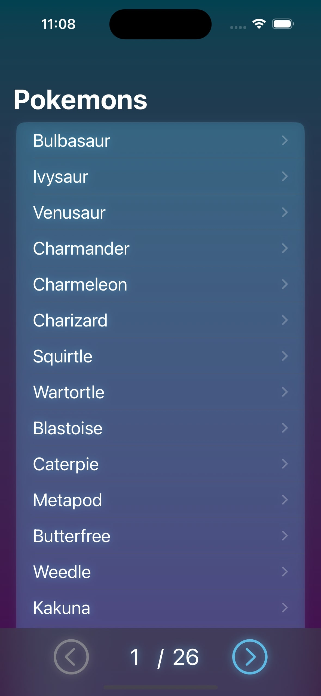
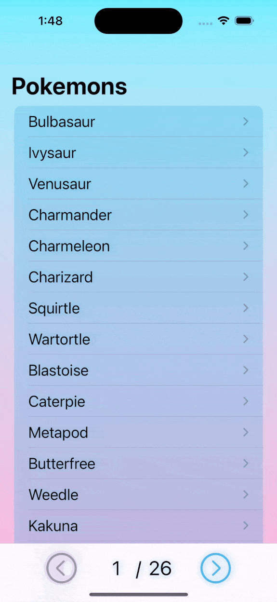
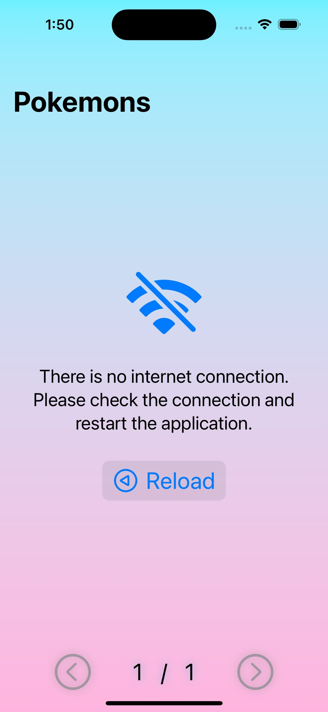
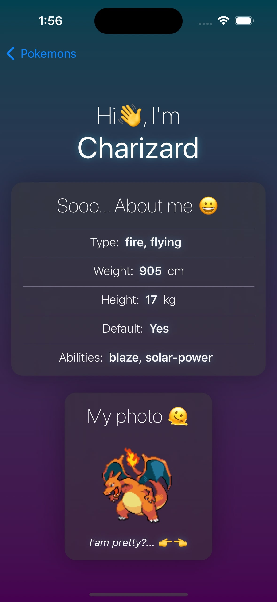

# Pokemon-Viewer Application (SwiftUI)

Pokemon-viewer is an application for the mobile operating system IOS 16.2 and above. The main functionality of the application is to get a list of Pokemon from a remote server (<a href="https://pokeapi.co/api/v2/pokemon">API</a>) through the Internet connection. There is an ability to view detailed information on each of the obtained pokemons. 
The application provides for handling any errors received during the program operation (example: server errors, no Internet connection, and data decoding errors).
And there is also an individual color theme (dark neon, and light) depending on the selected color theme on the user's device.

 ## Stack of technologies

- Swift(SwiftUI)
- MVVM
- Alamofire
- Async / Await
- SOLID
- Unit Tests / XCTest
  
## Application screens

1. Pokemons list - displays a list of pokemon received, with pagination buttons in the bottom toolbar.
2. Pokemon info - shows detailed info about the selected pokemon(name, characteristics, and optional image).
- Custom error and loader view - appears when loading data, or errors in loading data. 

# Application Features

## The app includes custom loading animation, and custom features

<dl>
  <li>
     Fully self-contained interface with support for error handling, and with their interaction.
  </li>
  <li>
     The color scheme of the application depends on the color scheme on the device (dark of light).
  </li>
  <li>
     The application is able to work on different devices supporting IOS 16.2.
  </li>
  <li>
     Ability to view detailed information about each pokemon.
  </li>
  <li>
     Each pokemon has its own picture (if there is no picture, the block is not displayed).
  </li>
  <li>
     Provided pagination, and the ability to switch between pages (if an error occurs, the buttons become inactive).
  </li>
  <li>
     Unit tests were written for the application and successfully passed.
  </li>
</dl>

# Getting Started

## Conditions for running the application 

- Device with MacOS Ventura, or later operating system.
- XCode Version 14.1, with a device or simulator running IOS 16.2.

## Installation

1. Clone this repository to your local MacOS machine.
2. Open applications using the file PokemonApp.xcodeproj.
3. Build the application on your local device or simulator.
4. Open the application, be pleasantly surprised that everything works, and enjoy life! 😀

